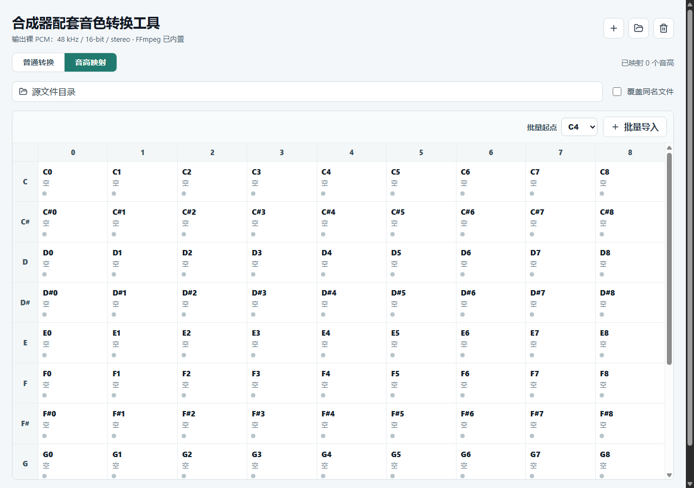
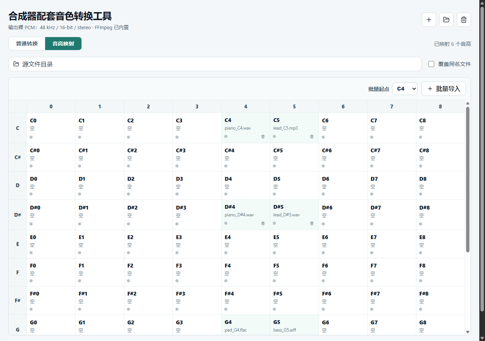

# 合成器配套音色转换工具说明

## 工具用途

这个小工具用于把常见音频文件批量转换为合成器音色工程更容易读取的裸 PCM 文件。

固定输出格式：

- 采样率：48 kHz
- 位深：16-bit
- 声道：立体声
- 字节序：little-endian
- 文件类型：无文件头的纯 PCM 裸流
- 扩展名：`.pcm`

支持输入格式取决于内置 FFmpeg，常见的 `wav`、`mp3`、`flac`、`m4a`、`ogg`、`aiff` 等都可以处理。

## 普通转换

普通转换适合把一批音频直接转为 PCM，不需要指定音高。

使用方式：

1. 切到 `普通转换`。
2. 点击 `+` 或中间区域选择音频文件。
3. 可选择输出目录；不选则默认输出到源文件目录。
4. 点击 `导出 PCM`。

普通转换的输出文件名会使用源文件名，例如：

```text
piano.wav -> piano.pcm
lead.mp3 -> lead.pcm
```


## 音高映射

音高映射适合制作带键位映射的合成器音色素材。界面提供 `C0` 到 `B8` 的大表，每个格子代表一个音高。

使用方式：

1. 切到 `音高映射`。
2. 点击任意音高格子，例如 `C5`，可以选择一个音频文件放进去。
3. 也可以从资源管理器把音频文件直接拖到目标格子。
4. 已经放进格子的音频可以拖到另一个格子，例如从 `C4` 拖到 `C5`。
5. 如果目标格为空，会移动过去；如果目标格已有文件，会互换两个格子的映射。
6. 点击 `导出 PCM` 会只导出已映射的格子。

音高映射的输出文件名使用音高名，不额外追加格式后缀：

```text
C5.pcm
D#6.pcm
F3.pcm
```





## 输出目录与覆盖

- `源文件目录`：未选择输出目录时，输出到每个源音频所在目录。
- `输出目录`：选择后，所有导出的 PCM 文件都会放到该目录。
- `覆盖同名文件`：启用后，同名 `.pcm` 会被覆盖；不启用时，工具会自动生成带序号的新文件名。

## 重新打包

项目根目录有一个脚本：

```text
重新打包.cmd
```

双击即可重新生成安装包。当前安装包默认输出到：

```text
src-tauri\target\release\bundle\nsis\合成器配套音色转换工具_0.1.0_x64-setup.exe
```
